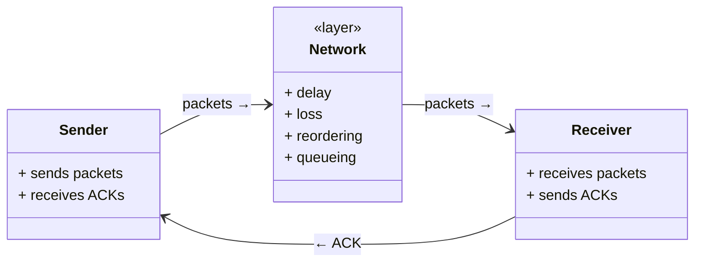
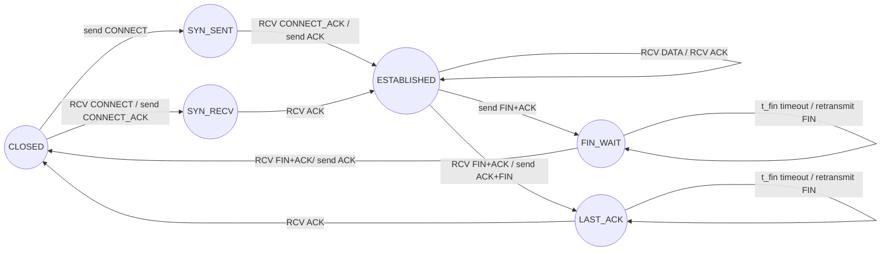
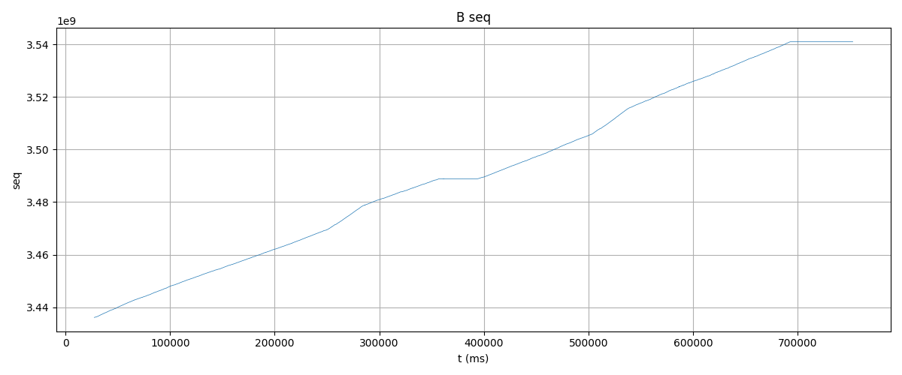
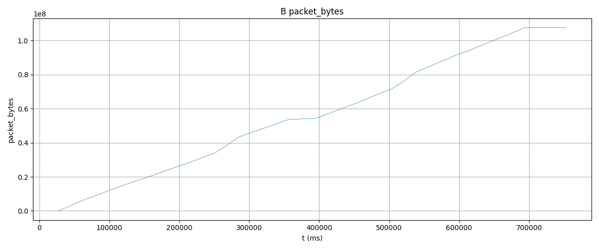
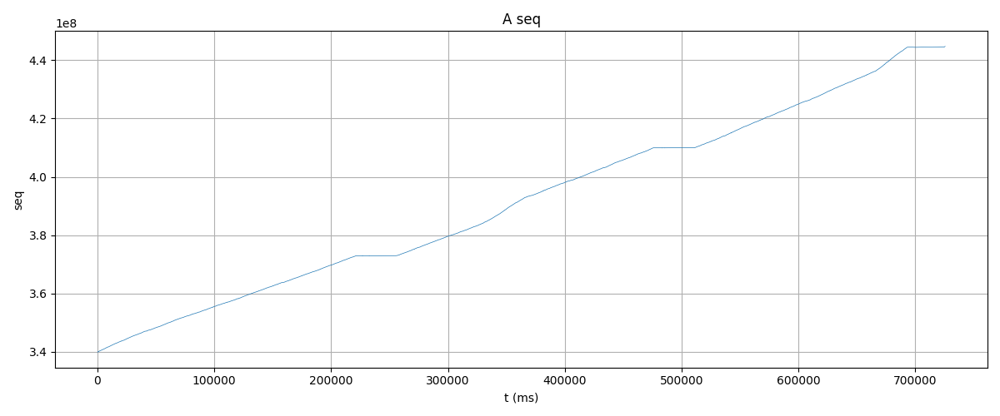
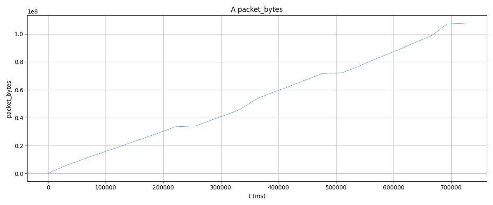
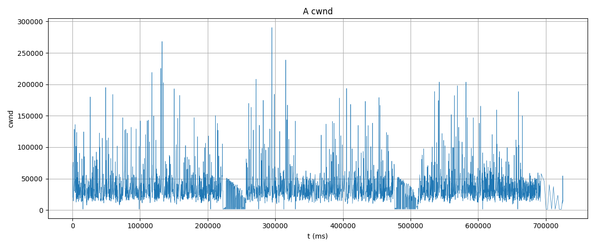

# SCP (Simple Stream Control Protocol)

[中文介绍](./docs/中文/README中文.md)

SCP is a lightweight and predictable stream‑oriented protocol built on top of UDP or any unreliable transport. It focuses on clarity, controllability, and a small, easy‑to‑understand state machine suitable for user‑space networking, embedded systems, and internal service communication.

It provides reliable byte‑stream delivery with sequence numbers, ACK/SACK, retransmission, flow control, congestion control, connection setup, and graceful shutdown, all implemented with a compact and readable codebase.

## Features

- Small and readable implementation, easy to port or extend
- Reliable byte‑stream transport with ACK/SACK
- Timeout‑based retransmission and congestion control
- Full connection lifecycle (CONNECT / FIN)
- Tunable behavior for different environments
- Efficient reordering and timer management using red‑black trees

## Design



### state machine



## Performance

In a realistic weak‑network test environment with delay, jitter, light packet loss, reordering, and bandwidth limits (20 ms ± 5 ms latency, 0.5% loss, 5% reordering, 50 Mbps rate, 500‑packet queue), ,a test was written to send 100MB files bidirectionally. Each round of the loop had a certain delay, taking more than 700 seconds, with bandwidth wasted at around 10%.

**nodeB:**



**Transmitted bytes for nodeB**




## Use Cases

SCP is suitable for scenarios requiring reliable, controllable, and lightweight transport over UDP or other unreliable channels, such as internal service communication, large file transfer in embedded/RTOS environments, and synchronization between game servers or real‑time systems.

## Getting Started

SCP requires only two core files plus a small data‑structure library:

```
scp.h
scp.c
```

Supporting data structures:

```
lib/
    rbtree.c / rbtree.h
    hashmap.c / hashmap.h
    queue.c / queue.h
```

SCP can run on top of any UDP transport. You only need to provide a simple send callback to integrate it into your system.

## Running the Test Program

The repository includes a bidirectional 100 MB file‑transfer test, which logs all protocol events in JSON format. A Python script is provided to visualize sequence evolution, congestion window behavior, retransmissions, and throughput.

### Prepare the test environment

Use `tc netem` to simulate a weak‑network environment:

```bash
sudo tc qdisc replace dev lo root netem \
    delay 20ms 5ms \
    loss 0.5% \
    reorder 5% 50% \
    rate 50mbit \
    limit 500
```

### Clone the repository

```bash
git clone https://github.com/skaiui2/SCP.git
cd SCP/test
```

### Build and run the test nodes

Two programs are provided: **nodeA** and **nodeB**, each sending a 100 MB file to the other.
 Open two terminals.

**Terminal 1 — start nodeB:**

```bash
cd nodeB
mkdir build
cd build
cmake ..
make
./nodeB > nodeB.log
```

**Terminal 2 — start nodeA:**

```bash
cd nodeA
mkdir build
cd build
cmake ..
make
./nodeA > nodeA.log
```

### Verify file integrity

After both transfers complete, place the four generated files in the same directory and verify their checksums.
 All files contain repeating bytes from 0–255, so their MD5 values should match:

```bash
md5sum testA.bin testB.bin outA.bin outB.bin
14d349e71547488a2a21c99115a3260d  testA.bin
14d349e71547488a2a21c99115a3260d  testB.bin
14d349e71547488a2a21c99115a3260d  outA.bin
14d349e71547488a2a21c99115a3260d  outB.bin
```

### Generate analysis plots

Inside the `test` directory, create an output folder:

```bash
mkdir output
```

Copy the analysis script and logs into it:

```
cp analyze_scp.py nodeA.log nodeB.log output/
cd output
python3 analyze_scp.py
```

The script will generate several plots, including:

- Sequence number evolution
- Total transmitted bytes and bandwidth usage
- Congestion window dynamics

Example outputs (included in the repository under `test/output/`):

**Sequence evolution**



**Transmitted bytes**



**Congestion window**



These figures illustrate SCP’s behavior under delay, jitter, packet loss, and reordering, including visible cwnd drops caused by timeout‑driven retransmissions.

