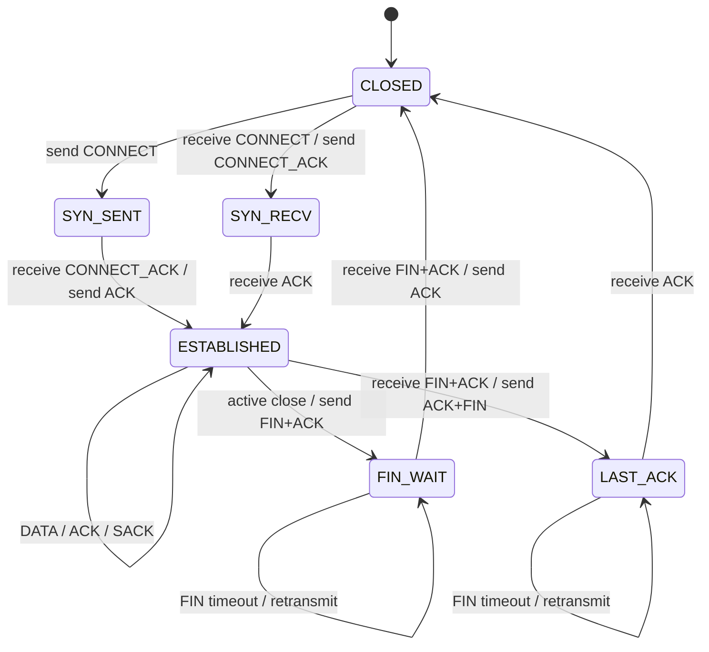

# SCP (Simple Stream Control Protocol)

[中文说明](./docs/中文/README中文.md)

SCP is a compact, stream-oriented reliable transport protocol implemented over UDP or another unreliable packet transport. It is designed for protocol research, user-space networking, embedded systems, and environments where the transport behavior must remain visible and easy to modify.

SCP provides sequencing, ACK/SACK processing, retransmission, flow control, connection management, RTT/RTO estimation, and congestion control without depending on a kernel TCP stack. The project currently contains two interchangeable congestion controllers:

- **SCP-PROB**: an experimental nonlinear controller that converts loss and RTT evidence into a continuous congestion-likelihood signal.
- **AIMD**: a conventional baseline used for comparison and coexistence experiments.

The current implementation also includes a sender-side pacing layer. Packets admitted by the congestion window are assigned transmission times derived from `cwnd` and RTT, then released by the pacing timer.

> **Project status:** SCP is a research prototype, not a production replacement for TCP. Its API, wire format, and congestion-control behavior may change. Current experiments have identified a serious fairness limitation under zero random loss; the limitation and the measurements are documented below.

The probability-driven controller is described in [SCP-PROB: Probability-Driven Nonlinear Congestion Control](./SCP-PROB_Probability-Driven_Nonlinear_Congestion_Control.pdf).

## Features

- Reliable byte stream over an unreliable packet transport
- Sequence numbers, cumulative ACKs, and SACK information
- Out-of-order buffering and retransmission
- Receiver-advertised flow-control window
- RTT, RTT variance, and retransmission-timeout estimation
- CONNECT/FIN connection lifecycle
- Pluggable congestion-control callbacks
- Probability-driven nonlinear controller and AIMD baseline
- Sender-side pacing based on `cwnd / RTT`
- Red-black trees for timers and out-of-order receive buffers
- Small C implementation intended to remain inspectable and portable

## Repository layout

```text
scp.c / scp.h                  protocol core
lib/                           intrusive containers and data structures
test/nodeA / test/nodeB        Linux integration tests
setup_scp_netns.sh             reproducible network-namespace topology
test/analyze_scp.py            log analysis
docs/                          user documentation
```

The protocol core sends packets through a user-provided transport callback:

```c
struct scp_transport_class {
    int (*send)(void *user, const void *buf, size_t len);
    int (*recv)(void *user, void *buf, size_t maxlen);
    int (*close)(void *user);
    void *user;
};
```

This makes the core independent of a particular UDP wrapper or network device.

## Connection state machine


```mermaid
stateDiagram-v2
    [*] --> CLOSED

    CLOSED --> SYN_SENT: send CONNECT
    CLOSED --> SYN_RECV: receive CONNECT / send CONNECT_ACK

    SYN_SENT --> ESTABLISHED: receive CONNECT_ACK / send ACK
    SYN_RECV --> ESTABLISHED: receive ACK

    ESTABLISHED --> ESTABLISHED: DATA / ACK / SACK
    ESTABLISHED --> FIN_WAIT: active close / send FIN+ACK
    ESTABLISHED --> LAST_ACK: receive FIN+ACK / send ACK+FIN

    FIN_WAIT --> CLOSED: receive FIN+ACK / send ACK
    LAST_ACK --> CLOSED: receive ACK

    FIN_WAIT --> FIN_WAIT: FIN timeout / retransmit
    LAST_ACK --> LAST_ACK: FIN timeout / retransmit
```

## Congestion control and pacing

### SCP-PROB

SCP-PROB replaces a purely binary congestion indication with a continuous signal built from loss deviation, RTT deviation, and their interaction. That signal drives nonlinear window increase and decrease.

The design target is robust transmission in lossy or variable environments. The current implementation demonstrates useful high-loss behavior, but the controller does **not** yet provide reliable fairness in every environment. In particular, the zero-random-loss results below show that identical PROB flows can converge to a strongly asymmetric allocation and that PROB can be starved by AIMD.

### AIMD

The AIMD implementation is retained as a baseline. It uses conventional additive increase and multiplicative decrease behavior and is selected through the same congestion-control interface as SCP-PROB.

### Pacing

The pacing layer does not replace the congestion window:

1. `cwnd` and the peer window determine how much data may enter the network.
2. The sender derives a per-packet interval from the current RTT and congestion window.
3. Packets receive increasing scheduled timestamps.
4. A 1 ms pacing timer sends every packet whose scheduled time has arrived.

Multiple packets may be released in one timer tick when their calculated interval is below 1 ms or when the process wakes up late. The pacing integration test measures calls to the real transport `send` callback; it does not claim to measure physical wire-departure time after qdisc.

## Build

The test programs are currently intended for Linux.

```bash
git clone https://github.com/skaiui2/SCP.git
cd SCP

mkdir -p test/nodeA/build test/nodeB/build

cd test/nodeA/build
cmake ..
make -j$(nproc)

cd ../../nodeB/build
cmake ..
make -j$(nproc)
```

To collect controller state for plots, change `SCP_DUMP_SS` in `scp.h` from `0` to `1`, then rebuild both nodes. Set it back to `0` for measurements that do not require time-series logs. JSON logging can perturb performance, so always record whether it was enabled.

When new test source files are added, rerun `cmake ..` before `make` because the current CMake files discover sources during configuration.

## Regression tests

The unified test runner provides five cases:

| Case | Purpose |
|---|---|
| `prob-100m` | Send one 100 MiB file with SCP-PROB |
| `aimd-100m` | Send one 100 MiB file with AIMD |
| `pacing` | Transfer and verify 8 MiB while recording real sender callback timing |
| `prob-prob` | Measure fairness between two continuously backlogged PROB flows |
| `prob-aimd` | Measure coexistence between continuously backlogged PROB and AIMD flows |

The 100 MiB tests preserve the historical one-way file test:

```text
nodeA/build/testA.bin  -->  nodeB/build/outB.bin
```

The test does not generate `testA.bin`. Prepare a file of exactly 100 MiB before running it:

```bash
cd test/nodeA/build
truncate -s 100M testA.bin
```

### Create the network topology

The repository provides a three-namespace topology:

```text
scp-c (client)  <-->  scp-r (router/netem)  <-->  scp-s (server)
```

Example: 5 Mbit/s per direction, 50 ms one-way delay, no random loss, and a 1000-packet queue:

```bash
cd SCP
sudo ./setup_scp_netns.sh setup 5mbit 50ms 0% 1000
sudo ./setup_scp_netns.sh ping
```

### Regression smoke test

The `all` mode checks that all cases can run sequentially. It deliberately combines several experiments and clock epochs, so its output is **not** a valid input for performance plots.

Start nodeB first:

```bash
cd test/nodeB/build
sudo ip netns exec scp-s ./nodeB all 10
```

Then start nodeA:

```bash
cd test/nodeA/build
sudo ip netns exec scp-c ./nodeA 10.0.2.1 all 10
```

The final argument is the measurement duration, in seconds, for each fairness case.

### Performance and figure runs

Run every measured case separately and save A/B output in case-specific files. For example, start the receiver:

```bash
cd SCP/test/nodeB/build
sudo ip netns exec scp-s ./nodeB prob-prob 300 \
    | tee nodeB-prob-prob.log
```

Then start the sender:

```bash
cd SCP/test/nodeA/build
sudo ip netns exec scp-c ./nodeA 10.0.2.1 prob-prob 300 \
    | tee nodeA-prob-prob.log
```

Use correspondingly named files such as `nodeA-prob-100m.log`, `nodeA-aimd-100m.log`, and `nodeA-prob-aimd.log`. Do not append unrelated cases to the same performance log.

### Verify file integrity

```bash
cd SCP
stat -c '%n %s' \
    test/nodeA/build/testA.bin \
    test/nodeB/build/outB.bin

md5sum \
    test/nodeA/build/testA.bin \
    test/nodeB/build/outB.bin
```

Both files must be 104857600 bytes and their hashes must match. No fixed hash is assumed because the input file is supplied by the user.

## Current validation snapshot

The following results are a transparent snapshot from **2026-08-19**, not a multi-run benchmark or a general performance claim.

Environment:

```text
rate:             5 Mbit/s per direction
one-way delay:    50 ms
expected RTT:     approximately 100 ms
queue limit:      1000 packets
file size:        100 MiB
fairness period:  300 seconds
```

### Zero random loss

| Case | Observed result |
|---|---|
| PROB, single flow | 4.686 Mbit/s receiver goodput |
| AIMD, single flow | 4.746 Mbit/s receiver goodput |
| Pacing | 8 MiB verified; 2.200 ms average sender-callback gap; at most 4 DATA packets observed in one millisecond |
| PROB vs PROB | 4.735 Mbit/s total; Jain index 0.641; flow ratio 6.95:1 |
| PROB vs AIMD | 3.421 Mbit/s total; Jain index 0.504; PROB received 0.36% of delivered bytes |

The transferred 100 MiB file passed end-to-end hash verification.

### Ten percent random loss

| Case | Observed result |
|---|---|
| PROB vs PROB | 2.044 Mbit/s total; Jain index 0.999887; flow ratio 1.022:1 |

These measurements expose an important unresolved behavior: random loss restores near-perfect fairness between the tested PROB flows, but at a large throughput cost. With zero random loss, the same controller can enter a persistent asymmetric allocation. This is an active research problem, not a solved property of the current controller.

In test output, `"status":"success"` means only that the case completed without a protocol or integrity failure. It does **not** mean that fairness or performance passed an acceptance threshold.

## Analysis

With `SCP_DUMP_SS=1`, SCP emits `type:"ss"` JSON records. Each record includes `stream_fd`, so the two flows in a fairness experiment can be plotted independently.

Generate complete diagnostic plots for both sender-side flows:

```bash
cd SCP
python3 test/analyze_scp.py test/nodeA/build/nodeA-prob-prob.log \
    --stream-fd 1 --out test/nodeA/build/plots-prob-prob-flow1

python3 test/analyze_scp.py test/nodeA/build/nodeA-prob-prob.log \
    --stream-fd 2 --out test/nodeA/build/plots-prob-prob-flow2
```

Generate compact publication figures:

```bash
python3 test/fig.py test/nodeA/build/nodeA-prob-prob.log \
    --stream-fd 1 --out test/nodeA/build/paper-prob-prob-flow1

python3 test/fig.py test/nodeA/build/nodeA-prob-prob.log \
    --stream-fd 2 --out test/nodeA/build/paper-prob-prob-flow2
```

For a single-flow log, `--stream-fd` may be omitted. Never feed an `all` log into the plotting scripts: it contains unrelated cases and reset clock epochs.

Because plots and congestion behavior change with the topology, controller revision, and random seed, the README intentionally does not treat old plots as current evidence. Preserve the raw command, source revision, build mode, netem parameters, and logs for every reported experiment.

## Intended uses and limitations

SCP is useful for:

- congestion-control and reliable-transport experiments;
- user-space or embedded transports over a custom unreliable medium;
- controlled internal communication and file-transfer experiments;
- teaching and inspecting transport-protocol mechanisms.

Current limitations include:

- unresolved zero-random-loss fairness and AIMD coexistence;
- no production security layer, authentication, or encryption in the protocol core;
- no claim of TCP compatibility;
- no stable wire-format or API guarantee;
- no large-scale interoperability, adversarial, or production deployment audit.

## AI assistance disclosure

The protocol direction, congestion-control model, mathematical formulation, architecture, and experiment questions are defined by the project maintainer.

Recent work used AI assistance in a limited but material way:

- the maintainer supplied the pacing design, constraints, and source-level pseudocode;
- AI tools assisted with C-code completion, review suggestions, regression-harness organization, and documentation editing;
- the unified test dispatcher and the dedicated pacing test contain AI-assisted code;
- historical single-flow and fairness test bodies were restored from named Git commits, with their entry points renamed for the unified runner;
- this README was rewritten with AI assistance.

AI output is not treated as experimental evidence. Code accepted into the project is manually reviewed by the maintainer and tested on the real Linux network-namespace setup. Reported results come from runtime logs and file-integrity checks. The Git history and raw test artifacts should be used to audit provenance.

## License

SCP is released under the [MIT License](./LICENSE).
