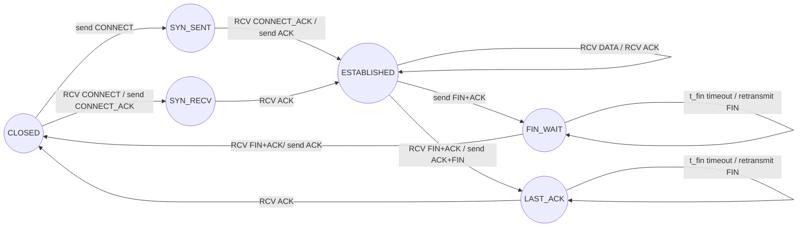

# SCP（simple stream control protocol）
一个简单、可控、稳定的流控制协议。

SCP 是一个构建在UDP或任何不可靠传输之上的轻量级可靠流协议，目标是在 TCP 过重的场景中提供一个简单、稳定、可维护的替代方案。

SCP比完整的TCP更加轻量，且更适合二次定制或开发，比KCP这些激进协议更温和可控，在内网质量网络环境下速度和带宽利用更好。

它实现了序号、ACK、SACK、重传、窗口、握手与关闭等必要机制，但保持了极小的代码规模和清晰的状态机，适合在用户态、嵌入式或内网环境中直接使用。

## 特性概述

- 基于不可靠数据传输的可靠字节流传输
- 简单可读的实现，易于移植和二次修改
- 支持 SACK、超时重传、窗口控制、拥塞控制
- 完整连接语义（CONNECT / FIN）
- 行为可控，可根据场景调整重传与窗口策略，同时适当修改以实现激进传输
- 使用红黑树处理乱序和定时器，乱序场景下表现更好

## 架构

状态图：




## 性能

在一个包含延迟、抖动、轻度丢包、乱序和带宽限制的真实弱网环境中（20ms±5ms、0.5% 丢包、5% 乱序、50Mbps、500 队列），编写一个双向互发100MB文件测试，每一轮循环延时一定时间，耗时700多秒，带宽浪费在10%左右。

## 适用场景

它适用于需要在 UDP 等不可靠数据传输上实现可靠、可控、轻量传输的场景，例如内网服务通信、嵌入式环境下的大文件传输，以及游戏服务器或实时系统的内部同步。

## 快速上手

SCP 只需要两个核心文件和基础数据结构文件夹：

```
scp.h
scp.c
```

基础数据结构目录：

```
lib/
    rbtree.c / rbtree.h
    hashmap.c / hashmap.h
    queue.c / queue.h
```

你可以在任意 UDP 传输层上构建 SCP，只需提供一个简单的发送回调。

## 运行测试程序

我编写了双向100MB文件互发测试程序进行测试，使用json格式打印，然后用python绘图。

让我们先准备测试环境，使用netem模拟：

```
sudo tc qdisc replace dev lo root netem \
    delay 20ms 5ms \
    loss 0.5% \
    reorder 5% 50% \
    rate 50mbit \
    limit 500
```

我们可以运行测试程序：

```c
git clone https://github.com/skaiui2/SCP.git
```

然后：

```
cd SCP
cd test    
```

下面有nodeA和nodeB，双方互发100MB文件。

开两个个终端：

先启动nodeB:
```
cd nodeB
mkdir build
cd build
cmake ..
make
./nodeB > nodeB.log
```

再启动nodeA：

```
cd nodeA
mkdir build
cd build
cmake ..
make
./nodeA > nodeA.log
```

传输完成后，把四个文件放到同一个文件夹下，检验一下文件的完整性：

testA和testB的内容都是从0到255然后循环，所以这四个文件计算出来的值都是一样的：

```
$:md5sum testA.bin testB.bin outA.bin outB.bin
14d349e71547488a2a21c99115a3260d  testA.bin
14d349e71547488a2a21c99115a3260d  testB.bin
14d349e71547488a2a21c99115a3260d  outA.bin
14d349e71547488a2a21c99115a3260d  outB.bin
```

接下来让我们生成图：

让在test文件夹下建立一个output文件夹：

```
mkdir output
```

接着把analyze_scp.py 、nodeA.log、 nodeB.log这三个文件放到该文件夹，运行脚本：

```
python3 analyze_scp.py
```

接着就会生成图片了：

我在项目中把之前运行的结果图片放到了test目录下面，你可以看一看：

seq变化：


A端耗时700000多ms，总发送数据：

带宽利用率还不错，并没有很多浪费：


拥塞控制窗口变化：

其中的小范围密集竖线是因为遇到了频繁的超时丢包事件：


