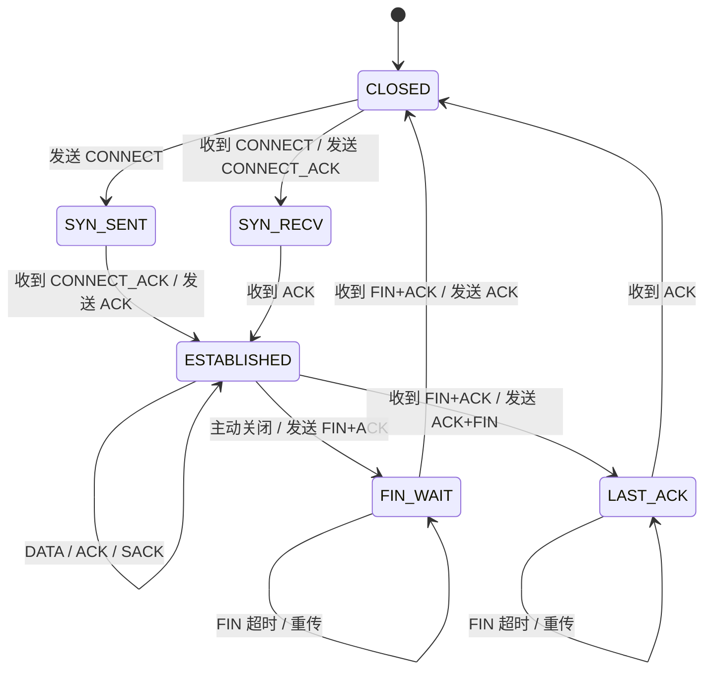

# SCP（Simple Stream Control Protocol）

[English README](../../README.md)

SCP 是一个构建在 UDP 或其他不可靠分组传输之上的轻量级可靠字节流协议。它面向传输协议研究、用户态网络、嵌入式系统，以及需要明确观察和修改传输行为的场景。

SCP 不依赖内核 TCP 栈，自行实现序号、ACK/SACK、重传、流量控制、连接管理、RTT/RTO 估计和拥塞控制。目前提供两种可切换的拥塞控制器：

- **SCP-PROB**：实验性的非线性控制器，将丢包和 RTT 证据转换为连续的拥塞似然信号。
- **AIMD**：用于对照和共存实验的传统基线。

当前版本还加入了发送端 pacing 层：拥塞窗口允许发送的数据会根据 `cwnd` 和 RTT 分配发送时间，再由 pacing 定时器释放。

> **项目状态：** SCP 是研究原型，不是可直接替代 TCP 的生产协议。API、线格式和拥塞控制行为仍可能变化。当前实验已经确认：在 0% 随机丢包下，现有控制器存在严重公平性问题。下面会完整公开这一限制和对应数据。

概率驱动控制器的理论见：[SCP-PROB：概率驱动的非线性拥塞控制](../../SCP-PROB_Probability-Driven_Nonlinear_Congestion_Control.pdf)。

## 特性

- 在不可靠分组传输之上提供可靠字节流
- 序号、累计 ACK 和 SACK 信息
- 乱序缓存与重传
- 接收端通告窗口
- RTT、RTT 方差和重传超时估计
- CONNECT/FIN 连接生命周期
- 可切换的拥塞控制回调
- 概率驱动非线性控制器和 AIMD 基线
- 基于 `cwnd / RTT` 的发送端 pacing
- 使用红黑树管理定时器和乱序接收缓存
- 保持可阅读、可移植的小型 C 实现

## 仓库结构

```text
scp.c / scp.h                  协议核心
lib/                           侵入式容器和基础数据结构
test/nodeA / test/nodeB        Linux 集成测试
setup_scp_netns.sh             可复现的 network namespace 拓扑
test/analyze_scp.py            日志分析
docs/                          使用文档
```

协议核心通过用户提供的发送回调输出数据：

```c
struct scp_transport_class {
    int (*send)(void *user, const void *buf, size_t len);
    int (*recv)(void *user, void *buf, size_t maxlen);
    int (*close)(void *user);
    void *user;
};
```

因此核心不依赖具体的 UDP 封装或网络设备。

## 连接状态机


```mermaid
stateDiagram-v2
    [*] --> CLOSED

    CLOSED --> SYN_SENT: 发送 CONNECT
    CLOSED --> SYN_RECV: 收到 CONNECT / 发送 CONNECT_ACK

    SYN_SENT --> ESTABLISHED: 收到 CONNECT_ACK / 发送 ACK
    SYN_RECV --> ESTABLISHED: 收到 ACK

    ESTABLISHED --> ESTABLISHED: DATA / ACK / SACK
    ESTABLISHED --> FIN_WAIT: 主动关闭 / 发送 FIN+ACK
    ESTABLISHED --> LAST_ACK: 收到 FIN+ACK / 发送 ACK+FIN

    FIN_WAIT --> CLOSED: 收到 FIN+ACK / 发送 ACK
    LAST_ACK --> CLOSED: 收到 ACK

    FIN_WAIT --> FIN_WAIT: FIN 超时 / 重传
    LAST_ACK --> LAST_ACK: FIN 超时 / 重传
```

## 拥塞控制与 pacing

### SCP-PROB

SCP-PROB 不再只使用二值拥塞信号，而是结合丢包偏差、RTT 偏差及其交互项，构造连续拥塞信号，再用非线性函数驱动窗口增加和减少。

其目标是在高丢包和强随机环境中保持可控传输。当前实现已经表现出有价值的高丢包行为，但它**尚未**在所有环境中提供可靠公平性。下面的 0% 随机丢包实验表明：两条相同的 PROB 流可能长期收敛到强烈不对称的分配；PROB 与 AIMD 共存时也可能被 AIMD 几乎完全饿死。

### AIMD

AIMD 作为基线保留，通过和 SCP-PROB 相同的拥塞控制接口进行选择，使用传统的加性增大和乘性减小行为。

### Pacing

pacing 不替代拥塞窗口：

1. `cwnd` 和对端窗口决定允许进入网络的数据量；
2. 发送端根据当前 RTT 和拥塞窗口计算逐包间隔；
3. 按递增方式为数据包分配计划发送时间；
4. 1 ms pacing 定时器发送所有已经到期的数据包。

当计算间隔小于 1 ms，或者用户态进程唤醒较晚时，同一个 tick 可以释放多个包。pacing 集成测试测量的是真实 transport `send` 回调时刻，不是数据经过 qdisc 后的物理链路离开时刻。

## 编译

当前测试程序面向 Linux。

```bash
git clone https://github.com/skaiui2/SCP.git
cd SCP

mkdir -p test/nodeA/build test/nodeB/build

cd test/nodeA/build
cmake ..
make -j$(nproc)

cd ../../nodeB/build
cmake ..
make -j$(nproc)
```

需要采集控制器状态并绘图时，把 `scp.h` 中的 `SCP_DUMP_SS` 从 `0` 改成 `1`，然后重新编译两端。不需要时间序列时改回 `0`。JSON 日志可能干扰性能，因此实验记录必须注明是否开启。

新增测试源文件后，需要先重新执行 `cmake ..` 再运行 `make`，因为当前 CMake 会在配置阶段扫描源文件。

## 回归测试

统一测试入口包含五项测试：

| 测试名 | 目的 |
|---|---|
| `prob-100m` | 使用 SCP-PROB 单向发送 100 MiB 文件 |
| `aimd-100m` | 使用 AIMD 单向发送 100 MiB 文件 |
| `pacing` | 传输并校验 8 MiB，同时记录真实发送回调时间 |
| `prob-prob` | 测量两条持续有数据的 PROB 流之间的公平性 |
| `prob-aimd` | 测量持续有数据的 PROB 与 AIMD 的共存情况 |

100 MiB 测试严格保留历史单向文件测试：

```text
nodeA/build/testA.bin  -->  nodeB/build/outB.bin
```

测试程序不会生成 `testA.bin`。运行前必须准备一个严格等于 100 MiB 的输入文件：

```bash
cd test/nodeA/build
truncate -s 100M testA.bin
```

### 建立网络拓扑

仓库提供三 namespace 拓扑：

```text
scp-c（客户端） <--> scp-r（路由器/netem） <--> scp-s（服务端）
```

下面模拟双向各 5 Mbit/s、单向 50 ms 延迟、0% 随机丢包和 1000 包队列：

```bash
cd SCP
sudo ./setup_scp_netns.sh setup 5mbit 50ms 0% 1000
sudo ./setup_scp_netns.sh ping
```

### 回归冒烟测试

`all` 用于检查所有 case 能否顺序跑通。它会混合多个独立实验和重新开始的时钟，因此输出**不能**用于绘制性能图。

先运行 nodeB：

```bash
cd test/nodeB/build
sudo ip netns exec scp-s ./nodeB all 10
```

再运行 nodeA：

```bash
cd test/nodeA/build
sudo ip netns exec scp-c ./nodeA 10.0.2.1 all 10
```

最后一个参数是每项公平性实验的测量时间，单位为秒。

### 性能与绘图实验

每个实验必须单独运行，并分别保存 A/B 日志。下面以 `prob-prob` 为例，先运行接收端：

```bash
cd SCP/test/nodeB/build
sudo ip netns exec scp-s ./nodeB prob-prob 300 \
    | tee nodeB-prob-prob.log
```

再运行发送端：

```bash
cd SCP/test/nodeA/build
sudo ip netns exec scp-c ./nodeA 10.0.2.1 prob-prob 300 \
    | tee nodeA-prob-prob.log
```

其他测试使用对应文件名，例如 `nodeA-prob-100m.log`、`nodeA-aimd-100m.log` 和 `nodeA-prob-aimd.log`。不能把无关 case 追加到同一个性能日志。

### 校验文件完整性

```bash
cd SCP
stat -c '%n %s' \
    test/nodeA/build/testA.bin \
    test/nodeB/build/outB.bin

md5sum \
    test/nodeA/build/testA.bin \
    test/nodeB/build/outB.bin
```

两个文件都必须为 104857600 字节，并且哈希值必须相同。由于输入文件由用户提供，因此 README 不再写死某个哈希值。

## 当前验证快照

以下结果来自 **2026-08-19** 的一次真实运行，只是透明记录，不是多轮基准测试，也不代表普遍性能结论。

环境：

```text
双向速率：        每方向 5 Mbit/s
单向延迟：        50 ms
预期 RTT：        约 100 ms
队列上限：        1000 包
文件大小：        100 MiB
公平性测量时间：  300 秒
```

### 0% 随机丢包

| 测试 | 观测结果 |
|---|---|
| PROB 单流 | 接收端有效吞吐 4.686 Mbit/s |
| AIMD 单流 | 接收端有效吞吐 4.746 Mbit/s |
| pacing | 校验 8 MiB；发送回调平均间隔 2.200 ms；同一毫秒最多观测到 4 个 DATA 包 |
| PROB 对 PROB | 总有效吞吐 4.735 Mbit/s；Jain 指数 0.641；流量比 6.95:1 |
| PROB 对 AIMD | 总有效吞吐 3.421 Mbit/s；Jain 指数 0.504；PROB 仅获得接收字节的 0.36% |

100 MiB 文件通过了端到端哈希校验。

### 10% 随机丢包

| 测试 | 观测结果 |
|---|---|
| PROB 对 PROB | 总有效吞吐 2.044 Mbit/s；Jain 指数 0.999887；流量比 1.022:1 |

这些数据暴露了当前尚未解决的重要行为：随机丢包让两条 PROB 流恢复了接近完美的公平性，但付出了很大的吞吐代价；在 0% 随机丢包下，同一控制器却可能进入持续的不对称分配。这是当前正在研究的问题，而不是现有控制器已经解决的性质。

测试输出中的 `"status":"success"` 只表示测试完整执行，没有发生协议或完整性错误；它**不表示**公平性或性能通过了某个验收阈值。

## 日志分析

开启 `SCP_DUMP_SS=1` 后，SCP 会输出 `type:"ss"` 状态记录。每条记录包含 `stream_fd`，因此可以分别绘制公平性实验中的两条流。

为发送端两条流分别生成完整诊断图：

```bash
cd SCP
python3 test/analyze_scp.py test/nodeA/build/nodeA-prob-prob.log \
    --stream-fd 1 --out test/nodeA/build/plots-prob-prob-flow1

python3 test/analyze_scp.py test/nodeA/build/nodeA-prob-prob.log \
    --stream-fd 2 --out test/nodeA/build/plots-prob-prob-flow2
```

生成论文用紧凑图片：

```bash
python3 test/fig.py test/nodeA/build/nodeA-prob-prob.log \
    --stream-fd 1 --out test/nodeA/build/paper-prob-prob-flow1

python3 test/fig.py test/nodeA/build/nodeA-prob-prob.log \
    --stream-fd 2 --out test/nodeA/build/paper-prob-prob-flow2
```

单流日志可以省略 `--stream-fd`。禁止把 `all` 日志直接交给绘图脚本，因为它包含互不相关的 case 和多次归零的时钟。

拥塞窗口和性能曲线会随拓扑、算法版本和随机种子变化，因此 README 不再把旧图片当作当前证据。报告实验时应同时保存命令、源码版本、构建模式、netem 参数和原始日志。

## 适用场景与限制

SCP 适合：

- 拥塞控制和可靠传输研究；
- 在自定义不可靠介质之上的用户态或嵌入式传输；
- 受控的内部通信和文件传输实验；
- 学习和观察传输协议机制。

当前限制包括：

- 0% 随机丢包下的公平性和 AIMD 共存问题尚未解决；
- 协议核心没有生产级安全层、认证或加密；
- 不兼容 TCP；
- 不保证线格式和 API 稳定；
- 尚未经过大规模互操作、对抗性测试或生产部署审计。

## AI 辅助声明

协议方向、拥塞控制模型、数学公式、系统架构和实验问题由项目维护者提出并决定。

近期工作有限但实质性地使用了 AI 辅助：

- 维护者提供 pacing 设计、约束和源码级伪代码；
- AI 工具辅助了部分 C 代码补全、代码审查建议、回归测试框架整理和文档编辑；
- 统一测试调度器和独立 pacing 测试包含 AI 辅助生成的代码；
- 历史单流与公平性测试主体从明确的 Git commit 恢复，只为统一入口修改函数名；
- 本 README 使用 AI 辅助重写。

AI 输出不被当作实验证据。项目维护者会人工审查接受的代码，并在真实 Linux network namespace 环境中运行测试。README 中报告的数据来自运行日志和文件完整性检查。代码来源应通过 Git 历史和原始测试材料审计。

## 许可证

SCP 使用 [MIT License](../../LICENSE)。
